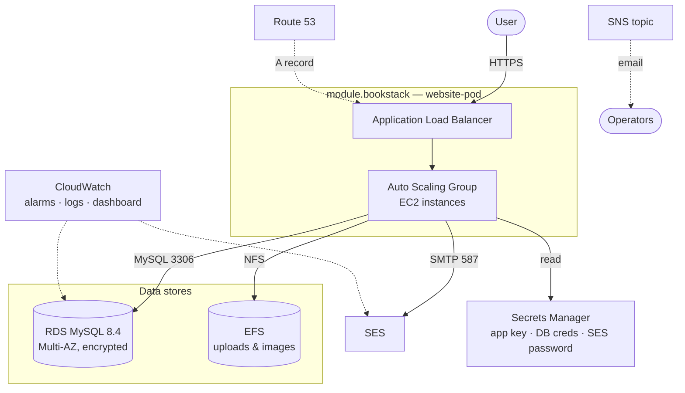

# Architecture

This module is a thin orchestration layer: it instantiates a few InfraHouse building-block modules
and wires the surrounding AWS resources to them. Terraform loads every `*.tf` file regardless of
name; the source is split by concern.

## Component overview

## Composed modules

| Module | Source | Role |
|--------|--------|------|
| `module.bookstack` | `infrahouse/website-pod/aws` | ALB + Auto Scaling Group, target group, HTTPS/ACM, access logs, DNS A-records. |
| `module.rds` | `infrahouse/rds/aws` | Multi-AZ encrypted MySQL 8.4 instance, security group, subnet group, parameter group, AWS-managed master secret, CloudWatch alarms + dashboard. |
| `module.bookstack-userdata` | `infrahouse/cloud-init/aws` | Generates cloud-init userdata that runs Puppet to provision BookStack; injects application config as Puppet facts. |
| `module.bookstack_app_key`, `module.ses_smtp_password` | `infrahouse/secret/aws` | Secrets Manager secrets (app encryption key, SES SMTP password). |

## Source files

- **`main.tf`** — the heart. Instantiates `module.bookstack-userdata`, `module.bookstack`, and the
  app-key/SES secrets, and feeds application configuration into the instances via the cloud-init
  module's `custom_facts` (Puppet Hiera facts): DB host/credentials, EFS mount, SES mail settings,
  Google OAuth secret, and the app key. It also sets a `pre_runcmd` that pre-stages the application
  tarball (see *Application delivery* below).
- **`db.tf`** — instantiates `module.rds` (MySQL 8.4, Multi-AZ, gp3, `binlog_format` not overridden)
  and resolves the name of the AWS-managed master-password secret for the application.
- **`efs.tf`** — encrypted EFS for shared uploads/images, mount targets per backend subnet, and an
  NFS security group scoped to the VPC CIDR.
- **`smtp.tf`** — SES sending via a dedicated IAM user whose access key auto-rotates on a
  `time_rotating` schedule (`smtp_key_rotation_days`); the IAM policy restricts the `FromAddress` to
  the Route 53 zone domain.
- **`secrets.tf`** — app key and SES SMTP password stored in Secrets Manager, each readable only by
  the EC2 instance role; a data source for the Google OAuth client secret.
- **`alarms.tf` / `sns.tf`** — SES bounce/complaint-rate CloudWatch alarms publishing to an SNS topic
  with email subscriptions. (RDS and ALB alarms are provided by their respective sub-modules.)
- **`datasources.tf`** — VPC/subnet/zone/AMI lookups and the EC2 instance-profile IAM policy that
  grants the role read access to exactly the secrets it needs.
- **`locals.tf`** — derived names, SES SMTP endpoints per region, and the EC2 role name/ARN.

## Request & data flow

1. A user hits `https://<service_name>.<zone-domain>`; Route 53 resolves to the ALB.
2. The ALB terminates TLS (ACM certificate) and forwards to a healthy instance in the ASG.
3. BookStack (running under nginx/PHP-FPM, provisioned by Puppet) connects to **RDS** for data and
   mounts **EFS** for uploads/images.
4. Outbound email goes through **SES** (SMTP, port 587) using credentials from Secrets Manager.
5. The instance reads the **app key**, **DB master credentials**, **SES SMTP password**, and **Google
   OAuth client secret** from Secrets Manager using its instance role.

## Application delivery

Instances do **not** build PHP dependencies at boot. The module's `pre_runcmd` downloads a pre-built
BookStack tarball — already containing the composer `vendor/` directory — into
`/var/tmp/bookstack.tar.gz` before Puppet runs. The Puppet profile's `download_package` and
`run_composer` steps then no-op (their `creates` guards are already satisfied), so provisioning is
deterministic and never depends on upstream package hosts at boot. The artifact URL is
`bookstack_prebuilt_package_url`; its BookStack version must match the version configured in the
Puppet profile.

## Cross-cutting concerns

- **Provider aliases.** Callers must pass `aws.dns` (a second AWS provider for Route 53) in addition
  to the default `aws`.
- **Userdata 16 KB limit.** Cloud-init userdata must fit AWS's 16 KB cap; the `userdata_size_info`
  output reports utilization and `compress_userdata` can gzip it.
- **One instance per backend subnet.** `asg_min_size`/`asg_max_size` default to the number of backend
  subnets (and +1 for max), giving Multi-AZ spread.
